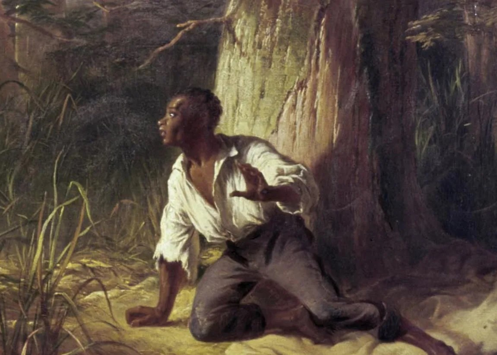

**HIST 289 -- Digital History: Enslaved Fugitives in Ohio**

**Fall 2025**

**Professor Frank "Trey" Proctor III**

Class: TTh 130-250 Talbot 229

Office Hours: MWF 10:30-1130, Tues 9-10, and **by appointment**
(in person oargumargument, to finalizing a draft.  Please visit the Writing Center
Website at
<a href="http://www.denison.edu/writingctr/" target="_blank">http://www.denison.edu/writingctr/</a> for locations and hours.

**L2 or Multilingual Support:** In addition to theo finalizing a draft.  Please visit the Writing Center
Website at
<a href="http://www.denison.edu/writingctr/" target="_blank">http://www.denison.edu/writingctr/</a> for locations and hours.

**L2 or Multilingual Support:** In addition to theZoom)

Office: 404 Fellows Hall

Telephone: 587-5791  
Email: <a href="mailto:proctorf@denison.edu" target="_blank">proctorf@denison.edu</a>

Preferred pronouns: he/him/his

This course is a hands-on, experimental, learn-as-we-go experience that
introduces both students and the faculty members to the use of digital
tools and sources to conduct original historical research, formulate
historical arguments, and communicate historical ideas in digital
formats (audio, visual, textual). In order to focus our efforts, we will
apply what we learn to a particular area of historical study: runaway
slave advertisements from nineteenth-century newspapers and runaway
slave narratives from Ohio.

You are being provided the sources -- runaway slave ads and narratives
-- and some experience with some digital tools. You are then being asked
to initiate a final, open-web project that illustrates the promise and
the limits of digital methods to study the past.

Tools/approaches will include XML (text encoding), visualizations
(Tableau), network analysis, and digital mapping or spatial history
(QGIS). Together we will begin to create a corpus of online sources by
collecting, transcribing, encoding, and posting runaway slave ads. In
addition, at the end of the semester, you will produce a piece of
digital history of your choosing based on those sources using one or
more of the tools we have explored together. That project can either be
a team-based project or an individual one.

In the end, we will create a class website project that will allow us to
bring together a variety of different visualizations and digital
storytelling methods into a single website. That site will include maps,
tables and graphs, digital stories, and textual information.

**Power and Justice: This course fulfills the Power and Justice General
Education Requirement.** As such, we will pay special attention to the
nature of power in the slaveholder-enslaved relationship (which some
scholars identify as the single most unequal social relationship in
human history), and how such power relations both informed, and were
informed, by other systems of power such as race, class, and sex/gender.

Similarly, we will explore how such systems of power permeate the
digital world and consider how we might avoid perpetuating them as we
create our own digital exhibition related to runaway slave narratives
and ads.

## Learning Goals:

1)  Gain an introductory knowledge of some of the digital tools or methods that can be useful to historians (such as mapping, social network analysis, distant reading, text encoding, etc.)

2)  Gain knowledge of and experience with the applications of genAI for Digital History work

3)  To consider the meaning of DATA; and, to explore how to treat historical sources as such

4)  Historical Thinking; or, Sharpening your ability to

    - Ask complex yet answerable historical questions

    - Articulate and communicate complex historical theses/arguments

    - Identify, locate, and marshal both *primary* and *secondary* forms of evidence in support of those arguments in written, oral, and visual forms in order to prove your position

    - Hone your skills at interpreting various types of written and visual primary sources and historical literature, to reinforce your ability to identify and critique the various explicit and implicit arguments within such sources, and to employ such sources in the service of making your own arguments.

5)  Digital Power and Justice

    - Seek a deeper understanding of the systems of power that underwrote enslavement including those of race and gender

    - Examine how the digital world can both perpetuate, and challenge, some of those systems of power in contemporary society

    - Consider how best to actively avoid internalizing such systems of power in our own knowledge creation and digital presentation

6)  Failing Productively

7)  Learn to apply technical knowledge about digital history to a substantive and complex historical subject

8)  Think explicitly and critically about how digital technologies change and potentially help the communication of historical narratives and interpretations.

9)  Acquire experience managing a team-based digital humanities project

10) Help construct a public-facing digital exhibition/project

## What to Expect

The unexpected! This class will likely (hopefully) feel different than a
usual history class. First, rather than just reading, discussing, and
writing history you will be asked to apply those skills and content
knowledge to make new things. You will decide what we produce
collectively, and you will carry most of the responsibility for creating
the final product(s).

Second, and relatedly, the class focuses equal time on technical skills
as on reading and discussing history. As such, nearly every Thursday
will be a lab wherein the instructors will lead you through a tutorial
and you will then apply your new skills to new problems.

Thirdly, this will likely be the one of the most collaborative classes
you will take at Denison. The team who is coming together to teach the
class (six people in all) should be a signal about the collaborative
nature of the generation and presentation of knowledge in digital forms.
No one can know everything, and often the best work is produced by a
team of specialists with particular skills. Hopefully, then, this class
will help sharpen your teamwork and project management skills in
addition to the digital and historical skills you will hone.

Finally, the goal of the class is to create a "semi"-public facing,
iterative project. The hope is that you will create the foundation of a
public-facing website that will grow and expand every time I offer this
course. You will generate content to populate that site, you will begin
the process of collecting, sorting, and presenting the data that future
classes will add to. This also means that we have to be attentive to our
audience(s). This should be a different experience, and product, then a
research class or readings colloquium.

## Office Hours

The purpose of office hours is to make myself available to my students
to discuss our class, their assignments, and perhaps even their larger
Denison experience. I am here and ready to help/talk/listen.

I would strongly encourage you to take advantage of office hours, or to
set up an appointment. I can promise that doing so will help you be your
most effective and successful in my course.

## Readings

*All assigned readings will be available from the Course Schedule in
Canvas for download and printing. Please bring printed copies of all
assigned readings to class on the day for which they appear on the
syllabus.*

## Assignments and Grades

**Weekly Work (10%)**

Throughout the semester we will complete various homework assignments
that will have a series of assignments with **technical**,
**non-technical,** and **data development**
dimensions aimed at developing the dual habits of thinking
computationally and historically at the same time.

- **Technical** -- The course is designed to be hands on, and you will be asked to complete various learning exercises throughout the semester. You will need to demonstrate that you have completed the exercises.

- **Non-technical** -- "Fail Logs and Lab Notes" -- This is a space for you to describe the work that you did for each lab. What can go into this? Anything and everything. What should go into this? A narrative of your work that connects the dots and explains the thinking of what you did, a series of bread crumbs that helps you work through your work; AND, a "fail log" or a description of where things fell apart and what you did to get back on track. **You must acknowledge the collaboration and assistance you received to address these issues**.

- **Data Development** -- Students will find, capture,
transcribe, and enter the data for 5 slave ads. This will include
creating a XML version of the ad AND entering data from the ad into
the database. *If we decide more are possible, we may increase the
number of ads*.

- **Software Installations** - Nothing can slow a class like this down like students troubleshooting software installations in-class. I will post instruction on how to get access to every technology we will use in class and you will be responsible for submitting a screenshot that proves the program is installed AND
 working before we use it in class.

 **Labs (15%)**

In addition to in-class "weekly work" in some instances you will be assigned a separate set of analyses that ask you to apply some of the techniques we have been learning.

**Website Assessment (10%)** 

At various points throughout the semester you will be required to analyze a Digital History Website

**Reading Responses (10%)**

Throughout the semester, I will post questions to Canvas for most of
the readings. At times these might be discussion boards, in other
instances they will be informal writing assignments. The goal is to
demonstrate that you are completing the readings; thinking critically
about the arguments therein; and, how they might impact our
class/project. (Students will be allowed to drop the lowest 10% of
scores)

**Final Project (40%)**

**Attendance and Contribution (15%)**

Denison, and History at Denison, are about the exchange of ideas. Rather
than thinking about contribution as something for you (an assignment),
think of it as an obligation to your classmates. They deserve for you to
be prepared, engaged, and to share your ideas so that they can more
thoroughly engage the material and the major questions we are
considering.

You are expected to attend class, to have completed the assigned reading
beforehand, and to contribute to our classroom conversations. Share your
ideas, questions, thoughts and respond thoughtfully, empathetically, and
meaningfully to the ideas of others. No small task.

**Contribution and Device Use Rubrics** - Attendance,
contribution to in-Class learning, and Appropriate Device Use

**A-range** - Attends all classes, arrives on time, and stays for the
entire duration. Consistently contributes to discussions in every class
with insightful, thoughtful, and relevant contributions that enhance the
discussion. Actively listens, responds to, and engages with others\'
comments, and is always respectful, encouraging, and supportive of
classmates.

**B-range** - Misses a few classes, generally punctual and present for
the full class. Regularly contributes but may not speak in every class;
contributions are relevant and show understanding of the material.
Generally listens and occasionally engages with others\' comments,
usually respectful and sometimes supports others.

**C-range** - Regularly attends but participates rarely and may be
frequently tardy. Speaks infrequently with minimal, sometimes off-topic
contributions showing basic understanding. Listens but rarely responds
to or acknowledges others, is respectful but passive and does not
actively support or collaborate with others.

**D-range** - Frequent unexplained absences, often late or leaves early.
Participates only very rarely with contributions that are often
off-topic, disruptive, or show lack of preparation. Occasionally listens
to others, may interrupt, and shows signs of disengagement. Sometimes
disrespectful or minimally collaborative.

**F-range** - Multiple unexplained absences, frequently late or leaves
early. Does not participate at all with contributions that are
off-topic, disruptive, or show a complete lack of preparation. Does not
listen to others, interrupts, or is completely disengaged. Disrespectful
or significantly disruptive to the class environment.

**Device Use Rubric for Computers, Phones, Tablets, and Smartwatches**

The rubric below outlines my expectations for device use in this
classroom. Unacceptable and below expectations device use will
negatively impact your contribution grade.

| **1. Unacceptable** | **2. Below Expectations** | **3. Meets Expectations** | **4. Exceeds Expectations** |
|---------------------|---------------------------|---------------------------|------------------------------|
| Use is *inappropriate*. Device is a distraction to others. **Examples**: A student uses their device to play games, view material unrelated to the course, OR hold social conversations. | Use is *distracting* to the student, their colleagues, and/or the instructor. Student frequently checks devices for information unrelated to the class. **Example**: A student takes out their phone to look at text messages several times in one class period. | Device is *not used* except during designed times, or device use is limited to quick checks during times of transition. **Example**: a student receives an important text from a parent, which they check quickly during our transition between group work and full-class discussion, but waits to respond until an appropriate time. | Device *only used* as an efficient academic tool for a direct purpose. Device is not a distraction. but used at appropriate times as an extension of work or learning. **Examples**: A student uses their phone to do research during a research project, or uses their laptop to create a collaborative document for a group project. |

**Final Project Assignment** --

Collectively, we will create a working prototype of a digital history
website devoted to runaway slave advertisements from Ohio newspapers.
The content of that website will be determined by the class, working as
individuals and/or teams, but will be primarily shaped by the techniques
and tools that we learn together in class.

That website will house three types of student work.

1)  DATA -- The first will be the data, students will encode a number of runaway ads throughout the semester, you will generate and populate a database that holds the structured data you deem important from the ads you select and encode.

2)  Interpretive Digital History projects -- working in teams, or even in one big team, you will build a piece of digital history using the data and skills we have developed over the course of the semester. *Students can elect to identify a new digital tool and apply it to their historical problem.* **This will require you to pose a historical question and to answer it in digital form using digital tools/techniques.**

3)  Collective Work on introducing the site.

***Grading of Final Project***

 **Collective Work (5%) --** The quality of the ads that you are responsible for transcribing AND the quality of your team's section of the class-site will be considered here.

**Final Report (7.5%) --** Your Final Report will consist of two parts:

1)  Critically evaluates the prototype website that we construct throughout the final weeks of the semester. Your essay will assign and defend a "grade" for our project, explaining your reasoning for your assessment of various elements of the project. If you had collaborators on your project, you will assess their work as well.

2)  Write a short essay, or podcast, wherein you reflect on your growth as a (digital) historian. Identify your greatest strength and greatest weakness that you have discovered as a result of taking this course. Describe your greatest achievement and your most epic fail from the semester. **Detailed instructions will follow.**

3)  You may also take the time to make substantive suggestions on how to refine or improve course? Does the 2X80mins work? Would you prefer a different schedule? Would you prefer to do the technical tutorials as homework and to focus more class time on content? Did you have sufficient time to complete your digital creative work? What other questions should I be asking you to consider relative to the class?

4) Reflect on the role of genAI in your work as a digital historian. Has our class altered your vision of or your approach to genAI?

**Final Project (20%) --** The exact form of this element of the assignment is largely up to students and or teams of students. Students will be expected to produce digital history. This could take the form of an extended podcast, an extended non-linear or "gamed" history, a series of visualizations. Each of these will require a narrative component, a write-up of your findings in a more traditional "history paper" format.

**Project Presentation (7.5%) -** During the final week of the semester (format TBD), each student group will present their final digital project to the class and invited guests. This will also be an opportunity to reflect on your experiences. This will likely take place outside of class.*More specific instructions will follow.*

**Acknowledgements --** As a relative novice in Digital Humanities, one
who wholeheartedly embraces William Cronon's notion of being a
"lifelong" learner, this course is the product of work of others; my
Digital Humanities Summer Institute instructors Anastasia Salter and John Murray, Ian Gregory, Jessica
Otis and Jon Simpson, and Ryan Cordell; my European Summer University in
Digital Humanities instructors Simone Rebora and Giovanni Vitale;
Educational Technology Specialists at Denison who have put up with me
along the way, Donnie Sendelbach, Trent Edmunds, Debra Andreadis, Kelli
Van Wasshenova, and Cheryl Johnson; and, the work and syllabi of other
practitioners and experts -- particularly historians Cameron Bievins,
Caleb McDaniel, Shawn Graham, and Sarah Purcell who have made their
classes available online, and the many people who contributed tutorials
to the Programming Historian website.

## Policies and Procedures

**AI USE** 

We will be actively using various LLMs throughout the semester to do Digital History. You will have access to the most powerful models through DenAI <a href="https://denai.denison.edu" target="_blank">denai.denison.edu</a>
- *Note:* You will need to be on Denison wifi or use the Denison VPN access this resource

**AI Policies**

The development of generative AI chatbots like ChatGPT, Claude, and Gemini are transforming the landscape of higher education. With that reality in mind, here are some guiding principles for the use of AI in our course (other faculty may have different policies, and it is **YOUR** responsibility to know what each of your professors determine is the acceptable and ethical use of AI in their courses).

AI can be a powerful tutor and instructor for many of the tools we will be exploring this semester. It is acceptable to you to use AI as an assistant in this regard, but it is extremely important that you clearly state how and why you used AI in your assignments.

- RECOGNIZE that my primary interest is to know what YOU THINK about the materials I have assigned. (I don’t care what a computer might produce as representing the “hive mind” or “groupthink ” best answer to a question based on what others have written.)

- If you consult AI, Academic Integrity requires that you ACKNOWLEDGE such use to your readers. Do so in a footnote. In a sentence, explain your use of AI and identify the tool(s) you consulted.

    - **Do not CITE AI.** Citations are meant to identify the work of other humans that you have consulted, and to provide a clear path to your evidence for your readers should they want to consult it themselves. AI-produced information is not reproducible, and thus is not a valid source.

In our class, AI will serve as a technical tutor, but should not be used to generate ideas or arguments.  Please do not use AI for reading responses or other writing we may do.

**Late Work:** Deadlines matter! This is an important thing to
recognize. However, life happens and I want to be as supportive and
flexible as I can relative to your ability to complete your assignments
to the best of your ability and in a timely manner.

Proactivity also matters! So, rather than a formal Late Policy, I am
going to require that you be proactive. If you contact me BEFORE a
deadline to let me know that you need extra time (for whatever reason)
AND provide a reasonable alternative deadline I will not impose late
penalties.

However, if you are not proactive, and simply turn in an assignment
late, I will impose late penalties as follows - unexplained late
assignments will be penalized one full letter grade on the day following
the due date (A to B) and one third of a letter grade (B to B-) for each
day after that.

**Reading Responses** will not be accepted late after you participate in
the discussion of the reading.

*Missed assignments will be assigned a score of zero.*

*Late informal assignments will not be accepted.*

**Academic Integrity:** Please do your own work. Plagiarism
will not be tolerated in any form. The students and faculty of Denison
University are committed to academic integrity and will not tolerate any
violation of this principle.  Academic honesty, the cornerstone of
teaching and learning, lays the foundation for lifelong integrity.

Academic dishonesty is, in most cases, intellectual theft. It includes,
but is not limited to, providing or receiving assistance in a manner not
authorized by the instructor in the creation of work to be submitted for
evaluation. This standard applies to all work ranging from daily
homework assignments to major exams. Students must clearly cite any
sources consulted---not only for quoted phrases but also for ideas and
information that are not common knowledge. Neither ignorance nor
carelessness is an acceptable defense in cases of plagiarism. It is the
student's responsibility to follow the appropriate format for citations.
Students should ask the professor for assistance in determining what
sorts of materials and assistance are appropriate for assignments and
for guidance in citing such materials clearly.

Proposed and developed by Denison students, passed unanimously by DCGA
and Denison's faculty, the **Code of Academic Integrity** requires that
instructors notify the Associate Provost of cases of academic
dishonesty, and it requires that cases be heard by the Academic
Integrity Board. Further, the code makes students responsible for
promoting a culture of integrity on campus and acting in instances in
which integrity is violated. The punishment for plagiarism/academic
dishonesty in this class will be a grade of zero for the assignment in
question and potentially a failing grade for the course in egregious
cases.

***Special Note - Digital History is a decidedly collaborative exercise.
With that in mind, please be mindful to give credit where credit is due,
and clearly articulate the work of others.***

**Disability Statement:** Any student who feels he or she may
need accommodations based on the impact of a disability should contact
me privately as soon as possible to discuss his or her specific needs. I
rely on the Academic Support & Enrichment Center in 104 Doane to verify
the need for reasonable accommodations.

**Writing Center:** The Center is a free resource available to
all Denison students.  Student writing consultants from many majors help
writers one-on-one in all phases of the writing process, from
deciphering the assignment, to discussing ideas, to developing an
argument, to finalizing a draft.  Please visit the Writing Center
Website at
[http://www.denison.edu/writingctr/](http://www.denison.edu/writingctr/) for locations and hours.

**L2 or Multilingual Support:** In addition to the
academic support services available to all Denison students, students
who use English in addition to other languages can meet with Denison's
Coordinator of Multilingual Learning, Kalynda Thayer. If English is not
your first or only language, please consider utilizing this resource,
which is available to ALL Denison students. Ms. Thayer offers a variety
of support for L2 students, including consulting with you about your
written language (grammar, syntax, word-choices), strategies to manage
your reading assignments, assistance with class conversation and
presentations, and to help devising ways to develop and effectively use
all your skills in English. You can email her at thayerk\@denison.edu to
schedule an appointment.

**The course adheres to Denison's Academic Credit Policy.** Significant feedback on writing is a core
component of this course. Students are expected to review instructor
feedback and reflect on how to incorporate that into their future work.
Students will be required to complete pre- or post-writing assignments
before and after official course meetings.

**Classroom Etiquette:** Please arrive to class on time, and
please turn off and put away your phones. Any student found using any
form of social media on their phones during class will be asked to
leave.

## Course Schedule - Fall 2025 (Subject to Change)

### Week 1 {#week1}

**Thursday, August 28**  
Introductions and Course Overview

 

- [Software Installations](installations.md)

- <a href="https://docs.google.com/document/d/1DdSkJG7Wpj0H35m_2D7ZgqPEDdy4K29KDfzQerxsr6M/edit?usp=sharing" target="_blank">**Exercise: Timeline_JS Assignment**</a>

### Week 2 {#week2}

**Tuesday, September 2**  
**What is History? Digital Humanities? Digital History?**

Readings:
- John Arnold, <a href="https://doi-org.denison.idm.oclc.org/10.1093/actrade/9780192853523.003.0001" target="_blank">*History: A Very Short Introduction*</a> (Oxford: Oxford University Press, 2000), 1-14.
- Anne Burdick, "<a href="https://doi.org/10.7551/mitpress/9248.003.0003" target="_blank">From Humanities to Digital Humanities</a>," in *Digital Humanities* (Cambridge, MA: MIT Press, 2012), 1-26.
- Stephen Robertson, "The Differences between Digital Humanities and Digital History," in *Debates in the Digital Humanities 2016* available at: <a href="http://dhdebates.gc.cuny.edu/debates/text/76" target="_blank">http://dhdebates.gc.cuny.edu/debates/text/76</a> (or <a href="https://muse.jhu.edu/book/46383" target="_blank">https://muse.jhu.edu/book/46383</a> CH 25)

- Jonathan Zimmerman, <a href="https://www.washingtonpost.com/opinions/2023/08/29/ai-student-policy-chatgpt-college/" target="_blank">“Here’s my AI policy for students: I don’t have one,”</a> Washington Post, August 29, 2023, Accessed Sept 12, 2023.  <a href="https://drive.google.com/file/d/1QtPAVn0XlV-fpQ4tFf1xEHyxv66WAiRX/view?usp=drive_link" target="_blank">Link to pdf of article</a> 

**Thursday, September 4**  
**Slavery - what was it like?**

Readings:

- Solomon Northup, *Twelve Years a Slave* Sections TBD

### Week 3 {#week3}

**Tuesday, September 9**  

**Mapping - Points**

Reading:
- Emily Johnson and Anastasia Salter, "<a href="https://doi-org.denison.idm.oclc.org/10.3998/mpub.14510509" target="_blank">Map</a>," *Critical Making in the Age of AI* (Amherst College Press, 2025)

**Website Review:** 
<a href="https://medievalmurdermap.co.uk/" target="_blank">Medieval Murder Map</a>

- Copy, rename, and move this <a href="https://docs.google.com/document/d/1iJ76JzlcSR5aH3mpuYpapCx6d-tvRedAPWAe6qwE_Mk/edit?usp=sharing" target="_blank">form</a> to complete the assignment. Paste the associated url into Canvas.

[**Exercise: Mapping Lab - Points**](MappingOne.md)
 
**Thursday, September 11**  
**Our Data?**

Readings:

- Ellen Gruber Garvey, "'<a href="https://doi-org.denison.idm.oclc.org/10.7551/mitpress/9302.003.0007" target="_blank">facts and FACTS': Abolitionists Database Innovations</a>," in *"Raw Data" is an Oxymoron*, Lisa Gitelman, ed. (Cambridge, Ma: MIT Press, 2013), 89-102.

**Exercise**

### Week 4 {#week4}

**Tuesday, September 16**  
**Slavery and Freedom in Ohio / XML**

Reading:
- Matthew Salafia, "Fugitive Slaves and the Borderland" from <a href="https://www-jstor-org.denison.idm.oclc.org/stable/j.ctt3fhvrx" target="_blank">*Slavery's Borderland: Freedom and Bondage Along the Ohio River*</a> (Univ. of Pennsylvania Press, 2013): 165-184.

XML Readings:

- <a href="http://dh.obdurodon.org/what-is-xml.xhtml" target="_blank">Obdurodon's "What is XML and Why should humanists care?"</a>
- <a href="https://fordhamgsdh.wordpress.com/2016/06/16/tei-and-xml-markup-for-absolute-beginners" target="_blank">TEI and XML Markup for absolute beginners</a>

**Exercise**

**Thursday, September 18**  
**Slavery and Freedom in Ohio cont. / XML**

Reading:
- R.H.M Blackett, "Western Kentucky and Ohio" in <a href="https://doi-org.denison.idm.oclc.org/10.1017/9781108275439" target="_blank">*The Captive's Quest for Freedom: Fugitive Slaves, the 1850 Fugitive Slave Law, and the Politics of Slavery*</a> (Cambridge Univ. Press, 2018): 222-268

### Week 5 {#week5}

**Tuesday, September 23**  

**Website Review:** 
<a href="https://freedomonthemove.org/" target="_blank">Freedom on the Move</a>
- Copy, rename, and move this <a href="https://docs.google.com/document/d/1iJ76JzlcSR5aH3mpuYpapCx6d-tvRedAPWAe6qwE_Mk/edit?usp=sharing" target="_blank">form</a> to complete the assignment. Paste the associated url into Canvas.

**Thursday, September 25**  
**XML/PEI (Proctor Encoding Initiative)**

**LAB**

### Week 6 {#week6}

**Tuesday, September 30**  
**Runaway Slaves in the US**

Readings:
- Franklin and Schweninger, *Runaway Slaves*, 5 & 9 and Appendix 7 "Runaway Slave Database"
- Stephanie Camp, <a href="https://heinonline.org/HOL/P?h=hein.peggy/csfd0001&i=51" target="_blank">*Closer to Freedom*</a>, Ch 2

**Thursday, October 2**  
**Interpretations of Runaways**

Readings:
- Antonio Bly, <a href="https://doi.org/10.1080/0144039X.2020.1801069" target="_blank">"'Indubitable Signs': Reading Silence as Text in New England Runaway Slave Advertisements,"</a> *Slavery & Abolition* 42:2 (2021): 240-268.
- I.M Nick, <a href="https://ans-names.pitt.edu/ans/article/view/2436" target="_blank">"In the Name of Freedom: A Corpus Linguistic Analysis of Personal Names Recorded in Fugitive Slaver Advertisements Published in New York and New Jersey 18th-Century Newspapers,"</a> *Names* 70:3(2022): 12-23.

### Week 7 {#week7}

**Tuesday, October 7**  
**Runaway Slaves in US, cont / ARC StoryMaps**

Readings:
- Susanna Ashton and Jonathan D. Hepworth, "<a href="http://theappendix.net/issues/2013/10/reclaiming-a-fugitive-landscape" target="_blank">Jackson Unchained: Reclaiming a Fugitive Landscape</a>," *The Appendix*, November 5, 2013
- Amani Marshall, "'<a href="https://doi.org/10.1080/01440391003711065" target="_blank">They Will Endeavor to Pass for Free': Enslaved Runaways' Performances of Freedom in Antebellum South Carolina</a>," *Slavery & Abolition* 31, no. 2 (2010): 161-180.

[**Exercise - ESRI StoryMaps and StoryMap.JS**](MappingTwo.md)

**Thursday, October 9**  
**Advanced Mapping / QGIS**

**Website Review** <a href="https://dsl.richmond.edu/panorama/redlining/" target="_blank">Mapping Inequality</a>
- Copy, rename, and move this <a href="https://docs.google.com/document/d/1iJ76JzlcSR5aH3mpuYpapCx6d-tvRedAPWAe6qwE_Mk/edit?usp=sharing" target="_blank">form</a> to complete the assignment. Paste the associated url into Canvas.

### Week 8 {#week8}

**Tuesday, October 14**  
**Advanced Mapping cont. / QGIS**

Reading:
- Susan Schulten, "<a href="https://doi.org/10.1353/cwh.0.0141" target="_blank">The Cartography of Slavery and the Authority of Statistics</a>," *Civil War History* 56:1 (2010): 5-32.

**Thursday, October 16**  
**FALL BREAK - NO CLASS**

### Week 9 {#week9}

**Tuesday, October 21**  
**Cool DH Reading / Mapping with AI**

Readings:
- Cameron Blevins, "<a href="https://www.jstor.org/stable/44285951" target="_blank">Space, Nation, and the Triumph of Region: A View of the World from Houston</a>," *The Journal of American History* 101:1 (2014): 122-147.

**Thursday, October 23**  
**Distant Reading Primer**

- Johanna Drucker, "Data Mining and Text Analysis," in *The Digital Humanities Coursebook* (Routledge, 2021),110-120.

- Cameron Blevins,<a href="http://www.cameronblevins.org/posts/topic-modeling-martha-ballards-diary/" target="_blank">“Topic Modeling Martha Ballard’s Diary,”</a> April 1, 2010

- Eleanor Stribling, <a href="https://medium.com/agatha-codes/a-bossy-sort-of-voice-3c3a18de3093" target="_blank">“A Bossy Sort of Voice: Quantifying gender bias in “Harry Potter” with Python and NLTK”</a> *Medium* May 4, 2018 (don't worry about the code)

- Aatish Bhatia, <a href="https://www.nytimes.com/interactive/2023/04/26/upshot/gpt-from-scratch.html?searchResultPosition=1" target="_blank">“Watch an A.I Learn to Write by Reading Nothing but Jane Austen,”</a> The New York Times, April 27, 2023 (accessed 9/11/23) 

**Website Review** - <a href="https://dsl.richmond.edu/dispatch/introduction" target="_blank">"Mining the Dispatch"</a> to 

- Copy, rename, and move this <a href="https://docs.google.com/document/d/1iJ76JzlcSR5aH3mpuYpapCx6d-tvRedAPWAe6qwE_Mk/edit?usp=sharing" target="_blank">form</a> to complete the assignment. Paste the associated url into Canvas.

**Tutorial - Distant Reading with Voyant and nocodefunction.com**

### Week 10 {#week10}

**Tuesday, October 28**  
**Runaway Slave Narratives / Distant Reading with LLMs**

Readings:
- Selections from <a href="https://drive.google.com/file/d/1-2WiOYlB8uQekYhfINTRYp5v2US-IabV/view?usp=sharing" target="_blank">“From Narrative of the Life of Frederick Douglass, An American Slave. Written by Himself,” “From Slavery Days in Old Kentucky. A True Story of a Father Who Sold His Wife and Four Children. By One of the Children,” and “From Running a Thousand Miles for Freedom; or, the Escape of William and Ellen Craft from Slavery,”</a> in *The Long Walk to Freedom: Runaway Slave Narratives*, Devon W. Carbado and Donald Weise, eds., (Beacon Press, 2012): 39-66, 69-88, and 205-228.

**Tutorial** -  
[Reading Across Texts](Reading_Across_Texts.md)

**Thursday, October 30**  
**Distant Reading with AI Code Assistant**
- <a href="https://drive.google.com/file/d/17RlEPzRwrRxeVNiAyS3mgbb0zQzYAasV/view?usp=sharing" target="_blank">Narrative of Henry Bibb</a>

**Tutorial**

### Week 11 {#week11}

**Tuesday, November 4**  
**Digital Humanities and Data**

Readings:

- Catherine D'Ignazio and Lauren Klein, "CH 6 - The Numbers Don't Speak for Themselves," in <a href="https://dewey2.library.denison.edu/record=b8287792~S6" target="_blank">*Data Feminism*</a> (Cambridge, MA: MIT University Press, 2020), 149-172.
- Jessica Marie Johnson, <a href="https://doi-org.denison.idm.oclc.org/10.1215/01642472-7145658" target="_blank">"Markup Bodies: Black [Life] Studies and Slavery [Death] Studies at the Digital Crossroads,"</a> *Social Text* 36:4 (2018): 57-79.

- Pranshu Verma, <a href="https://www.washingtonpost.com/technology/2022/07/16/racist-robots-ai/" target="_blank">“These robots were trained on AI. They became racist and sexist,”</a> The Washington Post, July 16, 2022
- Nitasha Tiku, Kevin Schaul and Szu Yu Chen, <a href="https://www.washingtonpost.com/technology/interactive/2023/ai-generated-images-bias-racism-sexism-stereotypes/" target="_blank">“This is how AI image generators see the world,”</a> The Washington Post (November 1st, 2023) 

**Thursday, November 6**  
**Visualizations / Tableau**

Readings:
- Nathan Yau, <a href="https://drive.google.com/file/d/1HNFFzp9un-9yW8LFRP0lfzoILzL-bX-B/view?usp=sharing" target="_blank">*Data Points: Visualization That Means Something*</a>, selected chapters

### Week 12 {#week12}

**Tuesday, November 11**  
**Digital History - A Critique** **/** **Tableau**

Readings
- Jesse Hoffnung-Garskof, "<a href="https://doi-org.denison.idm.oclc.org/10.1093/ahr/rhab007" target="_blank">Cuban Racial Politics in Nineteenth-Century New York: A Critical Approach</a>," *American Historical Review* 126:1 (2021): 109-139.
- John Theibault, "<a href="https://quod.lib.umich.edu/d/dh/12230987.0001.001/1:8/--writing-history-in-the-digital-age?g=dculture;rgn=div1;view=fulltext;xc=1#8.1" target="_blank">Visualizations and Historical Arguments</a>"

**Thursday, November 13**  
**Visualizing Data II - Humanities Provocations / Final Projects**

Readings:
- Johanna Drucker, "<a href="https://www.ucl.ac.uk/dh/events/SusanHockeyLecture/2016" target="_blank">Graphic provocations: What do digital humanists want from visualization?</a>" (watch the lecture)
- Lauren Klein, "<a href="https://hdsr.mitpress.mit.edu/pub/oraonikr/release/3" target="_blank">What Data Visualization Reveals: Elizabeth Palmer Peabody and the Work of Knowledge Production</a>," *Harvard Data Science Review* 4:2 (2022): 1-34.

**Website Review** <a href="https://Unsilencing-slavery.org" target="_blank">(Un)Silencing Slavery</a>
- Copy, rename, and move this <a href="https://docs.google.com/document/d/1iJ76JzlcSR5aH3mpuYpapCx6d-tvRedAPWAe6qwE_Mk/edit?usp=sharing" target="_blank">form</a> to complete the assignment. Paste the associated url into Canvas.

### Week 13 {#week13}

**Tuesday, November 18**  
**Other cool tools - Inky, OpenRefine, and GEPHI**

- Billy Perrigo, “OpenAI Used Kenyan Workers on Less Than $2 Per Hour to Make ChatGPT Less Toxic,” TIME, January 18, 2023

- <a href="https://samplereality.itch.io/content-moderator-sim" target="_blank">Content Moderator Sim</a>

**Thursday, November 20**  
**Final Project Workday**

### THANKSGIVING BREAK (Nov 24-28) {#thanksgiving}

### Week 14 {#week14}

**Tuesday, December 2**  
**Final Project Workday**

**Thursday, December 4**  
**Final Project Workday**

### Week 15 {#week15}

**Tuesday, December 9**  
**Presentations and/or Final Project Workday**

**Thursday, December 11**  
**Presentations**

Course Evaluations

**Final Project Due: Sunday, December 14, 2025 @ 8:30pm**
